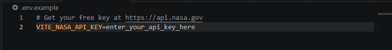
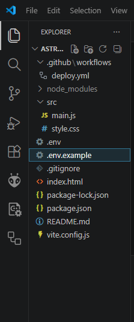
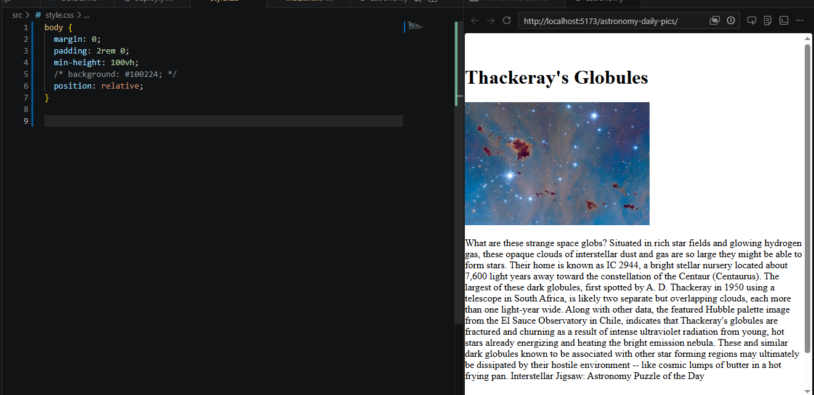

# a nasa daily astronomy image site using their public APOD API
hi! in this guide we will be learning how to use javascript to fetch an API. this is beginner friendly but covers some intermediate concepts like setting up vite and deploying with github actions. in this project we will be using a public API safely with vite and deploying it live on github pages.

## what exactly will we build? 
a website that fetches nasa's astronomy picture of the day and displays the title, image (or video), and explanation. it automatically updates every day with a new image.
> **note:** this is a simple project meant to teach you the concept of working with APIs. i have intentionally kept this project as simple as possible and avoided adding extra features to leave those modifications for you. you are welcome to use this as a learning reference but please do not submit an exact copy - make it your own by changing the design, adding features, or using a different API.

i have divided this guide into small stages so nothing gets tangled, and have attached some resources below. 
## prerequisites
 
- [Node.js](https://nodejs.org) version 20 or higher installed
- a [GitHub](https://github.com) account
- a code editor like [VS Code](https://code.visualstudio.com)
- a free nasa API key from [api.nasa.gov](https://api.nasa.gov)

## why are we using vite instead of plain html/css/js?
great question. you could technically write this in a plain html file, but you would immediately run into a problem, where do you put your API key?

if you paste it directly into your javascript file and push to github, anyone can see it. that's bad practice even for a free API. we solve this by using a `.env` file to store the key locally and adding it to a `.gitignore` file so it never gets uploaded to github. vite then lets us access that hidden key using `import.meta.env`, which is the standard modern workflow for frontend projects. it also gives you a real local server so your API requests actually work, and handles building and deploying your code to github pages.

**but** vite's `.env` is not bulletproof security. since this is a frontend project, your api key is technically still embedded in the built javascript files that get deployed. anyone who knows where to look could find it. for a free public api like nasa's apod, this is completely fine. the worst case is someone uses your key and hits the rate limit.

for sensitive apis (payments, private data, anything that costs money per request) you would never do this. you would build a backend server that makes the api call and sends only the data to the browser which will keep the key completely hidden. but that's a whole other topic.

for this project, vite gives us three things:
- a clean way to manage keys across local and deployed environments
- a real local server at `http://localhost:5173` so api requests actually work
- a build tool that bundles and optimizes our code for github pages

that's why we use it.

## create a vite project
open the folder where you want to create your project in vs code, open the terminal and run:

```bash
npm create vite@latest .
```

the `.` tells the terminal to create vite in the current folder instead of making a new subfolder.

when it asks questions, pick:
- framework: **Vanilla**
- variant: **JavaScript**

then install dependencies and start the dev server:
 
1. install dependencies
```bash
   npm install
```

2. start the dev server
```bash
   npm run dev
```
 
open the URL shown in your terminal (usually `http://localhost:5173`). you should see the vite demo page. that means everything is working.

press ctrl + c to stop the server for now.
 
> **important:** always use the localhost URL shown in your terminal to view your project. never open `index.html` directly in the browser or use the VS Code live preview extension. those don't understand vite's module system and your API key will not work.
 
## clean out the scaffold files

vite gives you a demo to show it works. every developer deletes these files and starts fresh with their own code because these files are only included as a template to prove your server is working.
 
- `src/counter.js`
- `src/javascript.svg`
- `public/vite.svg`
- remove boilerplate code from `./src/main.js` and `./src/style.css`

## get and store your API key safely
go to [api.nasa.gov](https://api.nasa.gov), fill out the basic form and they will email you a free key instantly. once you have it, create a `.env` file in the root of your project (same level as `package.json`).
```bash
VITE_NASA_API_KEY=your_actual_key_here
```
replace `your_actual_key_here` with the key you got from [api.nasa.gov](https://api.nasa.gov).

two things you should keep in mind:
- the variable name **must start with `VITE_`** - vite only exposes variables with that prefix to your frontend code
- no spaces around the `=`

also, create `.env.example` (this one you do push to GitHub so others know what variables are needed):


**after creating `.env`, always restart the vite server.** it only reads `.env` at startup, not on hot reload. press `Ctrl+C` in terminal then `npm run dev` again.

make sure your `.gitignore` file has these three lines:
```
.env
node_modules
dist
```

this tells git to never upload your real API key, the `node_modules` folder (too large, reinstalled via `npm install`), or the `dist` folder (auto generated on build).

## pushing to github and deploying
if you already know how to deploy and push to github, then you can skip this part!
### push to github

create a new repository on github. go to [github.com](https://github.com), click `+` then "new repository". name it whatever your project is called, set it to public, and **do not add a README or any other files**. then run these in your terminal one by one:

```bash
git init
git remote add origin https://github.com/yourusername/your-repo-name.git
git branch -M main
git add .
git commit -m "first commit"
git push -u origin main
```

check your repo on github after pushing. make sure `.env` is **not** there. you should see `.env.example` but never `.env`.

### configure vite for github pages

create `vite.config.js` in your project root and replace `your-repo-name` with your actual repo name:

```javascript
import { defineConfig } from 'vite'

export default defineConfig({
  base: '/your-repo-name/',
})
```

this tells vite where your site will be hosted. without it your assets won't load on github pages.

### store your api key as a github secret

since `.env` never goes to github, you store the key there instead:

1. go to your repo → settings → secrets and variables → actions
2. click "new repository secret"
3. name: `VITE_NASA_API_KEY`
4. value: your actual nasa api key

### create the deploy workflow

this is the part that automates everything. every time you push to `main`, github will automatically build your project and deploy it.  no manual steps needed.

i got this workflow from the [official vite deployment docs](https://vitejs.dev/guide/static-deploy#github-pages) and adapted it slightly. if you want to understand what each line does, the [github actions docs](https://docs.github.com/en/actions) break it all down. 

create `.github/workflows/deploy.yml` in your project and paste this:

```yaml
name: Deploy to GitHub Pages

on:
  push:
    branches: [main]

permissions:
  contents: read
  pages: write
  id-token: write

jobs:
  deploy:
    runs-on: ubuntu-latest
    environment:
      name: github-pages
      url: ${{ steps.deployment.outputs.page_url }}
    steps:
      - uses: actions/checkout@v3

      - uses: actions/setup-node@v3
        with:
          node-version: 22

      - run: npm install

      - run: npm run build
        env:
          VITE_NASA_API_KEY: ${{ secrets.VITE_NASA_API_KEY }}

      - uses: actions/configure-pages@v3

      - uses: actions/upload-pages-artifact@v3
        with:
          path: dist

      - uses: actions/deploy-pages@v4
        id: deployment
```

### enable github pages

1. go to your repo → settings → pages
2. under "source" select "github actions"
3. save

then push everything:

```bash
git add .
git commit -m "add deploy workflow"
git push
```

go to the actions tab on github and watch it run. when you see a green checkmark your site is live at: https://yourusername.github.io/your-repo-name/

### common errors and fixes

| error | cause | fix |
|-------|-------|-----|
| `cannot set properties of null` | `querySelector` found nothing | make sure `<div id="app">` exists in `index.html` and the script tag is below it in `<body>` |
| `api key is undefined` | `.env` is missing or vite wasn't restarted | create `.env` with your key and restart `npm run dev` |
| blank page with no errors | fetch failed  | add `.catch(err => console.log(err))` to see the error |
| still seeing vite demo page | old scaffold code still in `main.js` or `style.css` | select all and replace completely |
| 404 on github pages | wrong base path in `vite.config.js` | make sure `base` matches your exact repo name |
| `EPERM` error on windows | antivirus locking `node_modules` | run terminal as administrator |

one last thing: this workflow only runs when you push to `main`. so every time you make changes to your project, commit and push:

```bash
git add .
git commit -m "describe what you changed"
git push
```

github will automatically rebuild and redeploy your site. you don't have to touch the workflow again. it just runs in the background every time. think of it as your personal deployment robot that wakes up every time you push code. 

that was all the setup you needed before writing any code. make sure your folder looks something like this before moving on:


**now the fun part! let's write some code :D**

## make sure your index.html looks like this:
```html
<!doctype html>
<html lang="en">
  <head>
    <meta charset="UTF-8" />
    <meta name="viewport" content="width=device-width, initial-scale=1.0" />
    <title>astronomy</title> <!--put your project title here. in my case, im calling it astronomy.-->
  </head>
  <body>
    <div id="app"></div>
    <script type="module" src="/src/main.js"></script>
  </body>
</html>
```
this is the base structure for any vite vanilla js project. the only things you will ever change are the `<title>` and what goes inside `<body>`. the `<div id="app">` is just an empty box right now. your javascript will fill it with content at runtime. if you check the elements tab in your browser devtools after the page loads, you will see it filled with the title, image and explanation. even though your html file just says `<div id="app"></div>`. that's javascript doing its job.

also, notice the `type="module"` in the script tag - this tells the browser to treat your javascript as a modern ES module. without it, `import.meta.env` won't work and your API key will show as `undefined`.

basically, vite uses ES module syntax under the hood. `type="module"` enables features like `import`, `export`, and `import.meta` in the browser. it also automatically defers the script, meaning it waits for the HTML to fully load before running - which is why your `document.querySelector("#app")` always finds the element.

once you have the basics working, you can extend this by adding a search bar, date picker, or styling with css. the core fetch pattern stays the same.

for example if you wanted to add a date picker to view past NASA images, you would add this to `index.html`:

```html
<input type="date" id="datepicker"/>
<div id="app"></div>
```

and update `main.js` to use the selected date:

```javascript
const date = document.querySelector("#datepicker").value;
fetch(`https://api.nasa.gov/planetary/apod?api_key=${API_KEY}&date=${date}`)
```

but for this guide we are keeping it simple and focusing on the core concept. modifications are up to you!

## writing javascript code

this is going to be the most fun part. the entire logic of this project lives in `src/main.js`. let's build it step by step. i would highly suggest completing the tasks given below as they will help solidify your concepts. and honestly, when we review your projects and see you actually tried the tasks, it makes our day!
before we write a single line of code, let's think about something.

imagine you are ordering food from a restaurant. you place your order, the kitchen prepares it, and then it gets delivered to you. you don't just stand frozen at the counter waiting. you sit down, maybe scroll your phone, and when the food arrives you eat it.

fetching data from an API works exactly the same way.

**task 1:** before reading further, try answering this in your own words. how do you think fetching data from the internet works in javascript? don't worry about being technically correct, just think about it logically. write it down somewhere.

here is the rough flow:

1. you send a **request** to the API with a URL
2. the API processes it and sends back a **response**
3. you **convert** that **response** into **usable data**
4. you **display** it on the page

keep this flow in your head as you go through the tasks below. every step of the code maps directly to one of these four steps. by the end of the javascript section you will have implemented all four yourself.

### import your api key

```javascript
const API_KEY = import.meta.env.VITE_NASA_API_KEY;
```

`import.meta.env` is how vite gives your code access to variables stored in `.env`- the `VITE_` prefix is required - vite only exposes variables that start with it. without this your key will be `undefined`.

### show something while loading
before we write any fetch code, try **task 2**  first:
open `src/main.js` and try to display the text "hello world" inside the `#app` div using javascript. don't look anything up yet, just give it a try and see what happens.

`document.querySelector("#app")` finds the element with `id="app"` in your html. `.innerHTML` sets the content inside it. we will show "loading..." in our case immediately so the page is never blank while waiting for the api.
```javascript
document.querySelector("#app").innerHTML = "<p>loading...</p>";
```
.png)

### fetch the data
`fetch` makes a network request to the nasa api in the background.
```javascript
fetch(`https://api.nasa.gov/planetary/apod?api_key=${API_KEY}`)
```
 notice the backticks instead of quotes. that's because we're embedding `${API_KEY}` inside the url. the `${}` syntax replaces the variable with its actual value at runtime.

for example:
```javascript
const name = "alisha";
console.log(`hello ${name}`) // prints: hello alisha
console.log("hello ${name}") // prints: hello ${name}
```

regular quotes treat `${}` as plain text. backticks treat it as code.

### handle the response
now that we have fetched the data, we need to handle what comes back. before i show you how, let's think about it:

**task 3:** `fetch` gives you back a raw response. kind of like receiving a letter that's still in the envelope. what do you think you need to do before you can actually read the data inside it? give it a thought, then try writing it yourself.

once you have tried, here is how it works:
```javascript
.then(response => response.json())
```

`fetch` returns a promise, meaning it runs in the background while the rest of the page loads. `.then` runs when it finishes. `response.json()` converts the raw response into a javascript object you can work with.

### use the data
now you actually have the data in your hands. but before i show you what to do with it, here is a task:

**task 4:** you have `data` available now, which is the object nasa sent back. how do you think you would display just the title on the page? remember what you learned in task 2 about `innerHTML`. give it a try before moving on.

once you have tried, here is what `data` actually looks like. open your browser console and add `console.log(data)` to see everything inside it:

```javascript
.then(data => {
    console.log(data);
})
```
>**note:** these `.then()` blocks cannot float around by themselves. they must be chained directly onto the back of your `fetch()` statement like a continuous pipeline as shown in the picture below

you will see fields like `data.title`, `data.url`, `data.explanation`, and `data.media_type`. it should look something like this:

.png)
the fields we care about are:
- `data.title`: the name of today's image
- `data.url`: the image or video URL
- `data.explanation`: the description
- `data.media_type`: tells us if it's `"image"` or `"video"`

now we will focus on bringing this data on our site page which we can call our **task 5**. remove `console.log` and pause for a second and think - how would you put `data.title` inside `#app`?

i want you to try this yourself before seeing the guide further. 

hint: you already know `document.querySelector("#app")` and `.innerHTML`. try combining them with `data.title`.

i hope you must've tried it yourself, and if you were successful it would have looked something like this:
```javascript
.then(data => {
    document.querySelector("#app").innerHTML = `${data.title}`;
})
```
`document.querySelector("#app")` finds the element with `id="app"` in your html, the empty div we created earlier. `.innerHTML` then fills it with whatever string you give it. since we are using backticks we can embed `${data.title}` directly inside the string, which gets replaced with the actual title nasa sent back. so instead of seeing `${data.title}` on the page, you see whatever today's image is called. "Thackeray's Globules" in my case. `<h1>` is normally a html tag that makes the biggest heading.


.png)

**task 6:** try adding `data.url` as an image and `data.explanation` as a paragraph yourself in the same place where `data.title` exists, before scrolling down. 

**hint:** use the same `${}` syntax and the html tags you already know - `` and `<p>`.

here is the full solution:

```javascript
.then(data => {
    document.querySelector("#app").innerHTML = `
        <h1>${data.title}</h1>
        
        <p>${data.explanation}</p>
    `;
})
```
it must be looking like this:
.png)
.png)

you can include whatever you want depending on your api and idea.
the image seems huge right now but dont worry that is something we will fix eventually with css styling.

###  handle image or video

if you were able to make it here by implementing each task on your own, then you should be proud of yourself for building the whole thing yourself! now one important thing in our project is that nasa sometimes sends a video instead of an image. so `` won't always work. to solve this problem we handle it with an `if` statement. before moving forward, i want you to give it a try yourself. remember `data.media_type` tells you if it's "image" or "video". try writing an if statement to show either an `` or a `<video>` tag. it doesn't really matter if you didn't write the correct code at all, what matters is that you tried :D

here is how you should give it a try yourself:
```javascript
if (data.media_type === "image") {
    // show image
} else {
    // show video
}
```
solution:
```javascript
let media;

if (data.media_type === "image") {
    media = ``;
} else {
    media = `<video src="${data.url}" controls></video>`;
}
```
now, some of you might be wondering where did `document.querySelector("#app").innerHTML` go? or might be thinking why doesn't it look something like:
```javascript
if (data.media_type === "image") {
    document.querySelector("#app").innerHTML = ``;
} else {
    document.querySelector("#app").innerHTML = `<video src="${data.url}" controls></video>`;
}
```
see, this is technically a correct approach, but the problem is that every time you set `innerHTML` it replaces everything. so your entire code would look something like this:
```javascript
fetch(`https://api.nasa.gov/planetary/apod?api_key=${API_KEY}`).then(response => response.json()).then(data => {
    document.querySelector("#app").innerHTML = `<h1>${data.title}</h1>`;
    if (data.media_type === "image") {
        document.querySelector("#app").innerHTML = ``;
    } else {
        document.querySelector("#app").innerHTML = `<video src="${data.url}" controls></video>`;
    }
    document.querySelector("#app").innerHTML = `<p>${data.explanation}</p>`;
})
```
run this and you will only see the explanation - the title and image are completely gone because each `innerHTML` call wiped out the previous one.
.png)

the fix is to store the media in a variable first, then set `innerHTML` exactly once with everything inside it:
```javascript
.then(data => {
    let media;

    if (data.media_type === "image") {
        media = ``;
    } else {
        media = `<video src="${data.url}" controls></video>`;
    }
})
```
now we set `innerHTML` exactly once with everything inside it. `${media}` gets replaced with either the image or video tag we built in the previous step.
```javascript
document.querySelector("#app").innerHTML = `
    <h1>${data.title}</h1>
    ${media}
    <p>${data.explanation}</p>
`;
```

.png)
see the difference? i made the size of image small by using inline styles: `style="width: 300px; height: 200px;"` to show everything at once . so don't get confused :)

### handle errors

```javascript
.catch(err => {
    document.querySelector("#app").innerHTML = `<p>Error: ${err.message}</p>`;
});
```

`.catch` runs if anything goes wrong. no internet, wrong api key, api is down. without this, errors fail silently and you just see a blank page with no idea why.

### the complete code
if you were able to make it here then congrats! you have built your own (probably very first javascript code) yourself! you should sip some H2O now XD

this is how your complete code should look:
```javascript
const API_KEY = import.meta.env.VITE_NASA_API_KEY;

document.querySelector("#app").innerHTML = "<p>loading...</p>";

fetch(`https://api.nasa.gov/planetary/apod?api_key=${API_KEY}`)
  .then(response => response.json())
  .then(data => {
    let media;

    if (data.media_type === "image") {
      media = ``;
    } else {
      media = `<video src="${data.url}" controls></video>`;
    }

    document.querySelector("#app").innerHTML = `
      <h1>${data.title}</h1>
      ${media}
      <p>${data.explanation}</p>
    `;
  })
  .catch(err => {
    document.querySelector("#app").innerHTML = `<p>Error: ${err.message}</p>`;
  });
```
now that your javascript is working, let's make it look good. head over to `src/style.css` and let's add some styling.

## styling with css

before we get into the interesting stuff, here is a quick refresher on the basics. if you already know these, skip ahead!

| property | what it does |
|----------|-------------|
| `#app` | targets the element with `id="app"` |
| `.classname` | targets elements with that class |
| `background` | sets the background color. colors can be hex values like `#100224` or names like `white` |
| `margin: 0` | removes default browser spacing around the element |
| `padding` | adds space inside the element |
| `min-height: 100vh` | makes the element at least as tall as the screen |
| `width` / `height` | sets the size of an element |
| `color` | sets the text color |
| `font-size` | sets how big the text is, `rem` is relative to the root font size |
| `font-weight` | how thick the text is, 900 is the thickest |
| `font-family` | which font to use |
| `text-align` | aligns text left, right, or center |
| `line-height` | spacing between lines of text |
| `max-width` | prevents the element from getting wider than this value |
| `margin: 0 auto` | centers a block element horizontally |
| `text-decoration: underline` | adds underline to text |

if any of this is unfamiliar, i'd recommend going through [MDN's CSS basics](https://developer.mozilla.org/en-US/docs/Learn/CSS/First_steps) first and coming back. this section focuses on two concepts you probably haven't seen before: **pseudo-elements** and **clip-path**. those are the ones that make this design work and the ones worth spending time on.
### body
`margin: 0` removes the default white gap browsers add around the page. `min-height: 100vh` means the body is at least as tall as the screen. `vh` stands for viewport height. `position: relative` is needed so the side decorations know where to position themselves.

you should be able to see the difference here: 

.png)

### body::before and body::after
these are called **pseudo-elements**,  they are fake elements that css creates without you writing any html. `content: ''` is required to make them appear even though they have no text. `position: fixed` keeps them stuck to the sides even when you scroll. `z-index: -1` puts them behind all your content.
.jpg)

### clip-path: polygon()
this is the fun one. by default `body::before` and `body::after` are just plain rectangles. `clip-path: polygon()` cuts them into any shape you want by defining a list of points. `clip-path` cuts an element into any shape you define using coordinates. `polygon()` think of it like this: you have a rectangular piece of paper and you're cutting along a zigzag line with scissors. `clip-path` is the scissors, `polygon()` is the path you cut along. 

the points are written as `x% y%` pairs going around the shape:
```css
clip-path: polygon(
  0 0,       /* top left corner */
  100% 0,    /* top right corner */
  85% 2.5%,  /* first zigzag inward */
  100% 5%,   /* back out */
  85% 7.5%,  /* inward again */
  100% 10%,  /* back out */
  /* ...repeating all the way down... */
  0 100%     /* bottom left corner */
);
```
if you wanted curves instead you would use `path()`, but that's a lot more complex and straight lines are enough for our zigzag.
.png)
now i know what you're thinking. nobody writes 40 points by hand. and you're right, this is one of those cases where you can take help from some resources like: use of [Clippy](https://bennettfeely.com/clippy/) to create your own clip-path shape. it is a visual editor where you drag points around and it generates the css values for you. no manual coordinate writing needed.
### google fonts

google fonts is a free library of fonts you can use in any project without downloading anything. you just add a link in your html and use the font name in css.

go to [fonts.google.com](https://fonts.google.com), pick any font you like, click "get font" and it will give you a link to paste in your html. once you have selected your fonts on google fonts, click **"get font"** then **"get embed code"** and it will give you the exact link to paste in your html. no need to copy it manually.

in my case i am using:
- [Orbitron](https://fonts.google.com/specimen/Orbitron) for the title.
- [Black Ops One](https://fonts.google.com/specimen/Black+Ops+One) for the body text.
add this in your `index.html`, inside `<head>` before your css link:

```html
<link href="https://fonts.googleapis.com/css2?family=Orbitron:wght@900&family=Black+Ops+One&display=swap" rel="stylesheet">
```
then use them in css with `font-family: 'Orbitron', sans-serif`. the `sans-serif` at the end is a fallback. if google fonts fails to load, the browser uses its default sans-serif font instead.

```css
h1 {
  font-family: 'Orbitron', sans-serif;
}

p {
  font-family: 'Black Ops One', sans-serif;
}
```

.png)

### @media (max-width: 600px)
one last thing. on small screens the side strips overlap the content. we hide them on phones using a media query:

```css
@media (max-width: 600px) {
  body::before,
  body::after {
    display: none;
  }
}
```

a **media query** applies styles only when a condition is true. in this case when the screen is narrower than 600px. resize your browser window and watch the strips disappear. that's it, no javascript needed.
.png)

and that's a wrap on the styling! 
## that's it!
here is what the final project looks like:
.png)

not bad for a first project right? you just built a real website that talks to a nasa API, handles live data, and looks good doing it. now go make it your own, change the colors, try a different API, add a date picker. the hard part is done, the fun part is up to you :D

<!-- if anything here didn't make sense, or if you got stuck on a weird path error, just hit me up on on slack: **@Alisha**  -->